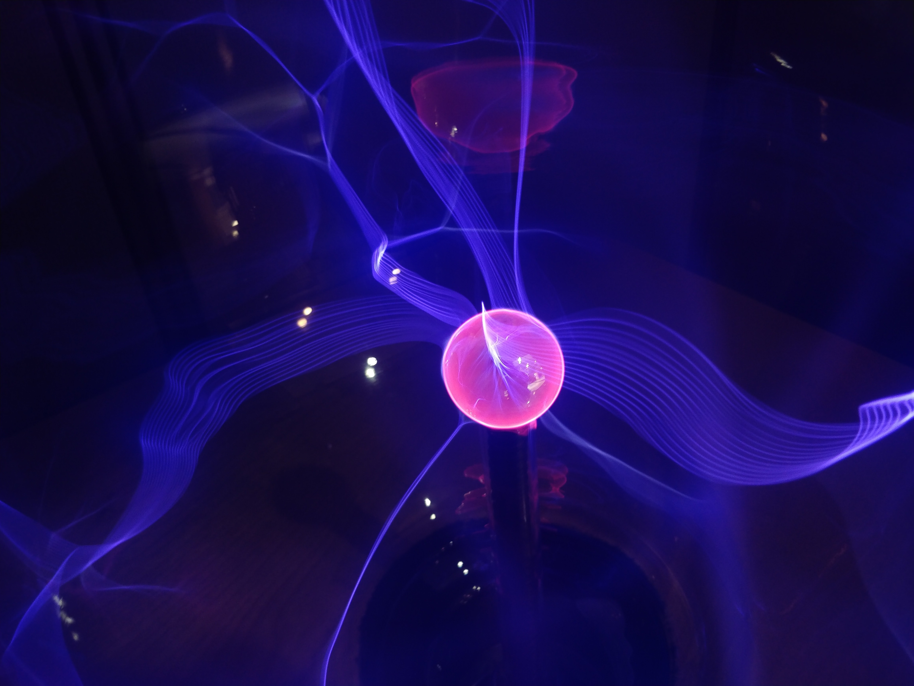
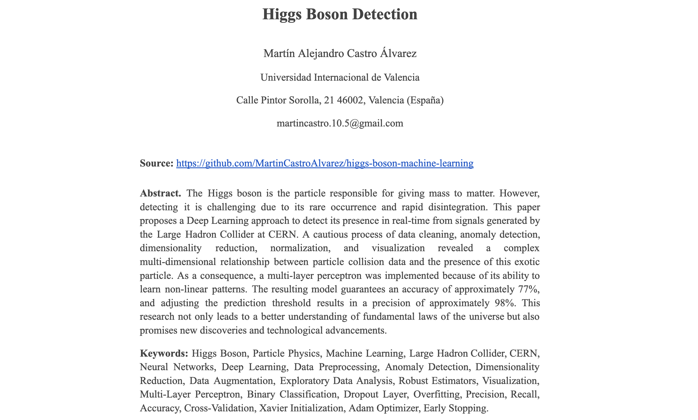
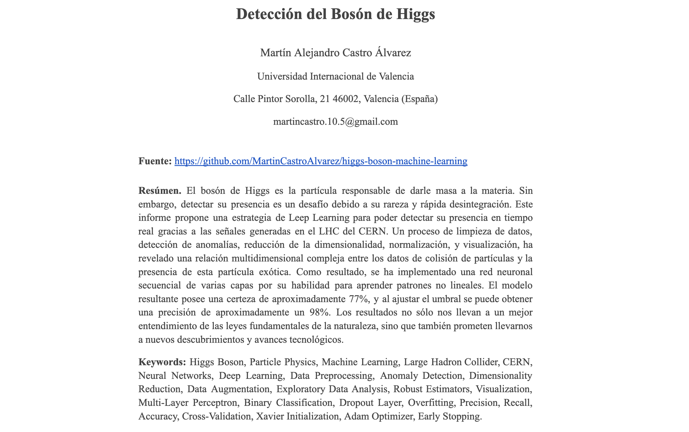
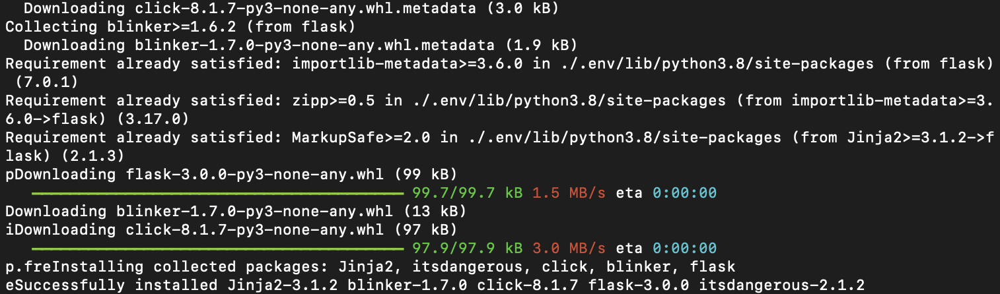
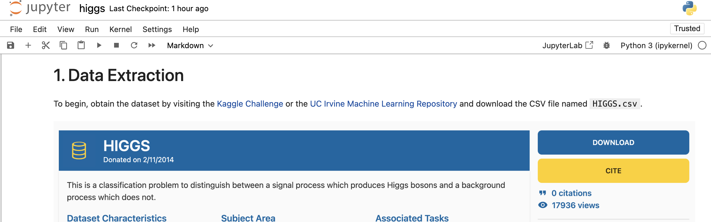
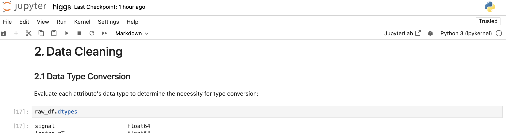
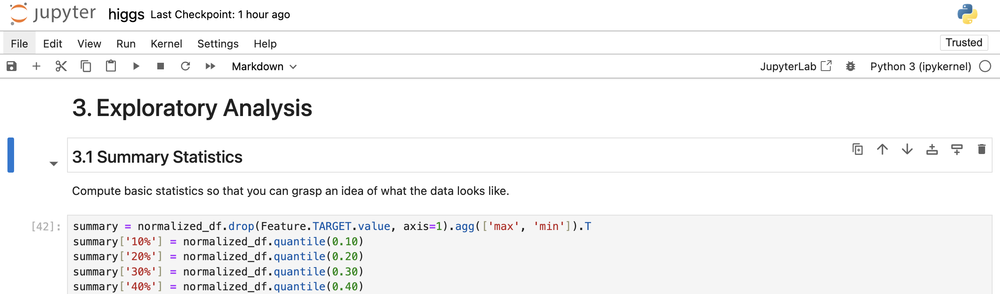
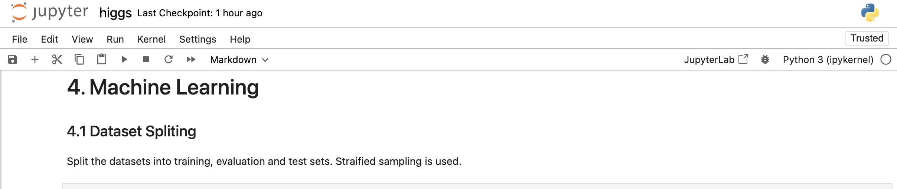
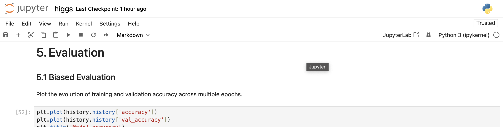
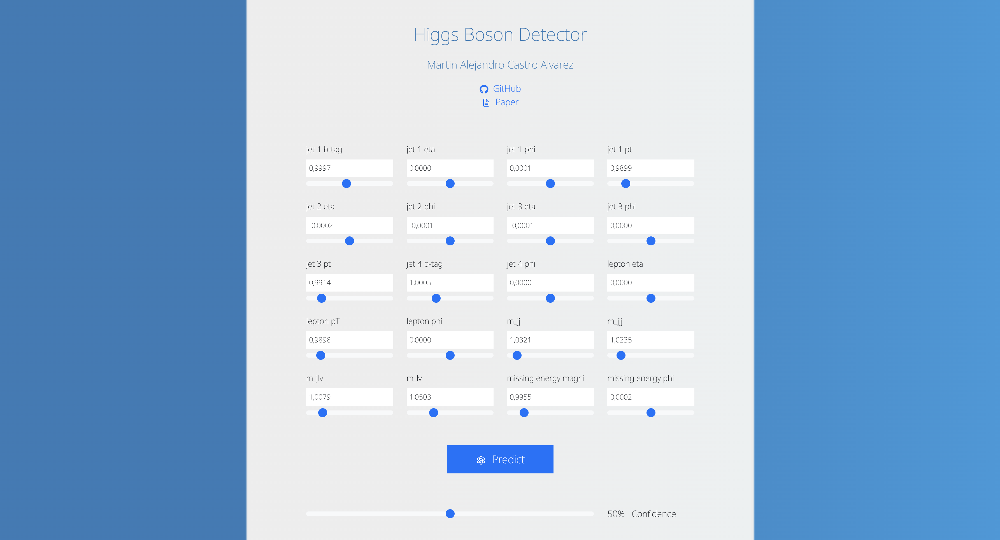

# Higgs Boson Machine Learning
Predicting the signal of a Higgs boson using Machine Learning.



## Paper

#### Read the paper in [English](PaperEN.pdf)



#### Read the paper in [Spanish](PaperES.pdf)



## Deployment

#### Step I: Install the dependencies

```bash
virtualenv -p python3 .env
source .env/bin/activate
pip install -r requirements.txt
```



#### Step II: Train the model following the instructions in [higgs.ipynb](higgs.ipnyb)

```bash
jupyter notebook
```







#### Step III: Start the Flask API

```bash
MODEL='viu_model.h5' STATS='viu_stats.csv' python3 api.py
```

##### GET `v1/schema`

Print the minimum and maximum value accepted per feature.

```bash
curl -X GET http://127.0.0.1:10000/v1/schema
```
```bash
{
  "jet 1 b-tag": {
    "max": 2.1730761528015137,
    "min": 0.0
  },
  "jet 1 eta": {
    "max": 2.96175217628479,
    "min": -2.9618031978607178
  },
  "jet 1 phi": {
    "max": 1.7414537668228147,
    "min": -1.7412374019622805
  },
  "jet 1 pt": {
    "max": 4.926361560821533,
    "min": 0.1375024318695068
  },
  "jet 2 b-tag": {
    "max": 2.2148721218109126,
    "min": 0.0
  },
  "jet 2 eta": {
    "max": 2.9093241691589355,
    "min": -2.909203767776489
  },
  "jet 2 phi": {
    "max": 1.7431747913360596,
    "min": -1.742371678352356
  },
  "jet 2 pt": {
    "max": 5.573495864868164,
    "min": 0.188981145620346
  },
  "jet 3 b-tag": {
    "max": 2.548224449157715,
    "min": 0.0
  },
  "jet 3 eta": {
    "max": 2.727277994155884,
    "min": -2.7278423309326167
  },
  "jet 3 phi": {
    "max": 1.7428839206695557,
    "min": -1.7420687675476074
  },
  "jet 3 pt": {
    "max": 5.525750160217285,
    "min": 0.2636076211929321
  },
  "jet 4 b-tag": {
    "max": 3.101961374282837,
    "min": 0.0
  },
  "jet 4 eta": {
    "max": 2.49634337425232,
    "min": -2.496431827545166
  },
  "jet 4 phi": {
    "max": 1.7433723211288452,
    "min": -1.7426908016204832
  },
  "jet 4 pt": {
    "max": 5.433091163635254,
    "min": 0.3653541505336761
  },
  "lepton eta": {
    "max": 2.4280500411987305,
    "min": -2.4281582832336426
  },
  "lepton pT": {
    "max": 5.851532459259033,
    "min": 0.27469664812088
  },
  "lepton phi": {
    "max": 1.7432359457015991,
    "min": -1.7425082921981812
  },
  "m_jj": {
    "max": 13.583667755126951,
    "min": 0.0750704556703567
  },
  "m_jjj": {
    "max": 7.2710919380188,
    "min": 0.1986757218837738
  },
  "m_jlv": {
    "max": 5.877596378326416,
    "min": 0.1320061683654785
  },
  "m_lv": {
    "max": 3.4313726425170894,
    "min": 0.0830486565828323
  },
  "missing energy magnitude": {
    "max": 6.109807968139648,
    "min": 0.0002370088477618
  },
  "missing energy phi": {
    "max": 1.7432570457458496,
    "min": -1.743615984916687
  }
}
```

##### POST `v1/predict`

Predict the presence of the Higgs boson in real-time.

```bash
curl -X POST http://127.0.0.1:10000/v1/predict -H "Content-Type: application/json" -d '{"events": [{"jet 1 b-tag": 0.0, "jet 1 eta": 0.0, "jet 1 phi": 0.0, "jet 1 pt": 0.2, "jet 2 b-tag": 0.0, "jet 2 eta": 0.0, "jet 2 phi": 0.0, "jet 2 pt": 0.2, "jet 3 b-tag": 0.0, "jet 3 eta": 0.0, "jet 3 phi": 0.0, "jet 3 pt": 0.3, "jet 4 b-tag": 0.0, "jet 4 eta": 0.0, "jet 4 phi": 0.0, "jet 4 pt": 0.4, "lepton eta": 0.0, "lepton pT": 0.3, "lepton phi": 0.0, "m_jj": 0.1, "m_jjj": 0.2, "m_jlv": 0.2, "m_lv": 0.1, "missing energy magnitude": 0.1, "missing energy phi": 0.0}]}'
```
```bash
{
  "prediction": [
    [
      0.999374270439148
    ]
  ]
}
```

#### Step IV: Start the React Web Application

Install the dependencies
```bash
npm install
```

Start the web application 
```bash
REACT_APP_API="http://localhost:10000" npm run start
```

#### Step V: Make Real Time Predictions

Visit [http://localhost:3000/] and submit the form.


